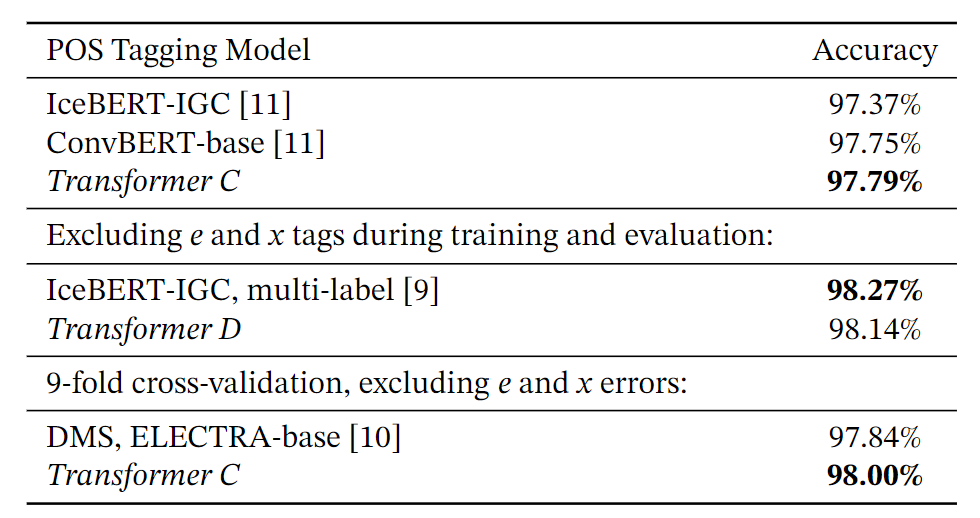

# Transformer-based POS tagger for Icelandic

This repository contains the source code to replicate the creation of the transformer-based POS tagger model used in the paper _Is Part-of-Speech Tagging a Solved Problem for Icelandic?_.

The fine-tuned models that are the basis for the evaluation of the model configuration reported in the paper are also made available.



There are also scripts to train and evaluate models new models. See subsections.

 If you find this work useful in your research, please cite the paper:

```
@inproceedings{
    karason2023is,
    title={Is Part-of-Speech Tagging a Solved Problem for Icelandic?},
    author={{\"O}rvar K{\'a}rason and Hrafn Loftsson},
    booktitle={The 24rd Nordic Conference on Computational Linguistics},
    year={2023}
}
```

## Trained models

The fine-tuned models for four model configurarions and 10-folds are provided. There are `.zip` files named A, B, C, and D that match models with same designations. The results for model C were reported in the paper (Table 2), and model D was used for comparison in the table here above (Table 3).

[Download models from Dropbox](https://www.dropbox.com/sh/3vfa3gbjypj3ang/AACq-ObhNhXLWph6Pe1RynjIa?dl=0)

## Training

```
python ./train.py --name x --fold 1
```

Use `--help` to see all parameter options.

## Evaluating

```
python ./evaluate.py --model x --fold 1
```

Use `--help` to see all parameter options.

## Data

[Version 21.05 of MIM-GOLD](https://clarin.is/en/resources/gold/) needs to be downloaded from CLARIN-IS. The scripts assume it is in a subfolder (`./MIM-GOLD-SETS.21.05/sets`), but the parameter `--data` can be used to point to a different folder with the fold sets.

```
wget https://repository.clarin.is/repository/xmlui/bitstream/handle/20.500.12537/114/MIM-GOLD-SETS-21.05.zip
unzip -o "MIM-GOLD-SETS-21.05.zip"
```

The training script handles downloading the pre-trained [jonfd/convbert-base-igc-is](https://huggingface.co/jonfd/convbert-base-igc-is) ConvBERT-base model from Hugging Face.
